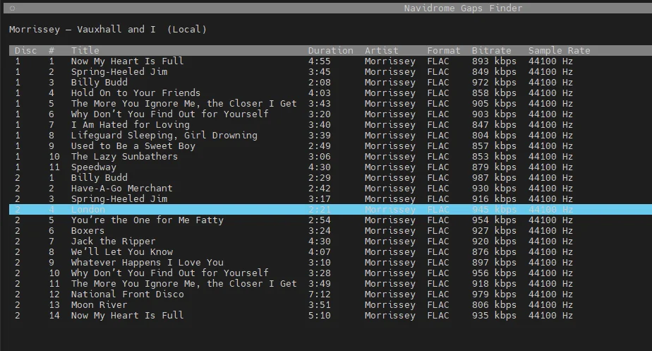
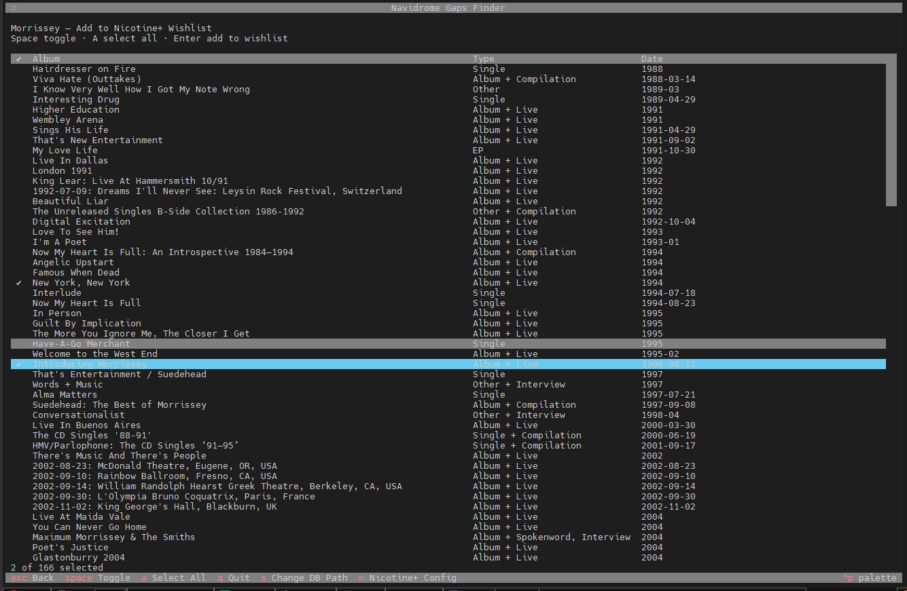
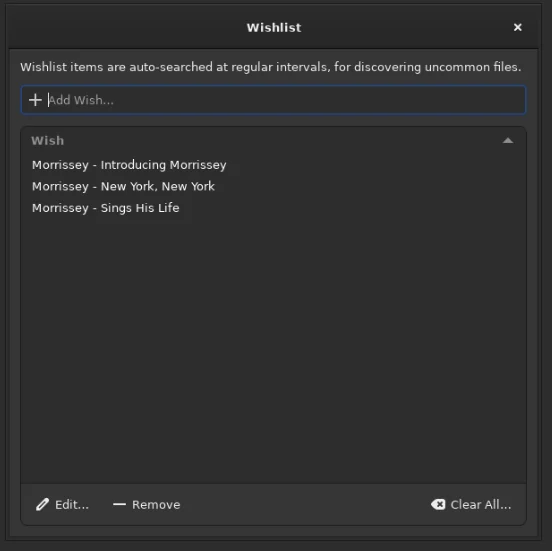

# 🎵 Navidrome Gaps Finder

A terminal UI application that helps you discover missing albums in your [Navidrome](https://www.navidrome.org/) music library by cross-referencing it with the [MusicBrainz](https://musicbrainz.org/) database.

<a href="https://buymeacoffee.com/succinctrecords"></a>

---

## How It Works

1. **Connects** to your Navidrome SQLite database
2. **Lists** all artists that have a MusicBrainz artist ID
3. **Fetches** the complete discography for a selected artist from the MusicBrainz API
4. **Compares** MusicBrainz release groups against your local library using `mbz_release_group_id`
5. **Displays** a side-by-side view of albums you own vs. albums you're missing
6. **Inspect tracks** for any album — view your local tracklist with full audio details, or browse MusicBrainz releases and their tracks
7. **Optionally integrates** with [Nicotine+](https://nicotine-plus.org/) — add missing albums directly to your Soulseek wishlist
8. **Tag untagged artists** — find artists missing MusicBrainz IDs, search MusicBrainz, and write the correct ID back to the database
9. **Find similar artists** — uses the [Last.fm API](https://www.last.fm/api) to discover artists similar to anyone in your library, and shows whether they're already in your collection

## Requirements

- Python 3.10+
- Access to your Navidrome `navidrome.db` database file
- *(Optional)* A [Last.fm API key](https://www.last.fm/api/account/create) for the Artist Similarity Finder feature

## Installation

```bash
git clone https://github.com/WB2024/WBs-Navidrome-Gaps-Finder.git
cd WBs-Navidrome-Gaps-Finder
python3 -m venv venv
source venv/bin/activate        # Linux / macOS
# venv\Scripts\activate         # Windows
pip install -r requirements.txt
```

> **Note:** On modern Debian/Ubuntu systems, installing packages globally with `pip` is blocked ([PEP 668](https://peps.python.org/pep-0668/)). Using a virtual environment as shown above is the recommended approach.

## Usage

```bash
# Make sure the venv is activated first
source venv/bin/activate        # Linux / macOS
# venv\Scripts\activate         # Windows

python main.py
```

You can also pass the database path directly via the command line to skip the interactive prompt:

```bash
python main.py --db /path/to/navidrome.db
```

On first launch (without `--db`), the app will prompt you for the path to your Navidrome database file. This is saved to `config.json` for future runs.

> **Tip:** If you can't paste into the TUI input field, use `Shift+Insert` or right-click instead of `Ctrl+V`. Alternatively, use the `--db` flag shown above.

### Install as a System Command (Linux / macOS)

You can install the app as a global `NDGAPS` command so you can run it from anywhere without activating the virtual environment manually.

1. Make sure you've completed the [Installation](#installation) steps above (clone, venv, pip install).

2. Create the wrapper script (run this **from inside the cloned repo directory**):

```bash
cd /path/to/WBs-Navidrome-Gaps-Finder

sudo tee /usr/local/bin/NDGAPS > /dev/null << EOF
#!/bin/bash
# Navidrome Gaps Finder launcher
INSTALL_DIR="$(pwd)"
source "\$INSTALL_DIR/venv/bin/activate"
python "\$INSTALL_DIR/main.py" "\$@"
EOF
```

This bakes the full path to whatever directory you're in, so it works regardless of where the repo is cloned.

3. Make it executable:

```bash
sudo chmod +x /usr/local/bin/NDGAPS
```

4. Run it from anywhere:

```bash
NDGAPS
# or with a database path
NDGAPS --db /path/to/navidrome.db
```

### Key Bindings

| Key       | Action                                          |
|-----------|--------------------------------------------------|
| `↑` / `↓` | Navigate the artist/album list                   |
| `Enter`   | Select an artist / inspect album tracks          |
| `Space`   | Toggle album selection (wishlist screen)          |
| `Escape`  | Go back                                          |
| `e`       | Export missing albums to CSV (comparison screen)  |
| `f`       | Cycle primary type filter (comparison screen)     |
| `t`       | Cycle secondary type filter (comparison screen)   |
| `o`       | Cycle sort mode (comparison screen)               |
| `w`       | Add missing albums to Nicotine+ wishlist          |
| `a`       | Select / deselect all (wishlist screen)           |
| `n`       | Configure Nicotine+ config path                  |
| `u`       | View/fix artists missing MusicBrainz IDs         |
| `l`       | Find similar artists via Last.fm                 |
| `s`       | Change database path                             |
| `q`       | Quit                                             |

Type in the filter box at the top to search for artists by name.

## Screenshots

### All Artists

The main screen lists every artist in your Navidrome library that has a MusicBrainz ID, along with their corresponding MBID.


### Filtering Artists

Type in the filter box to narrow down the list in real time. Select an artist with the arrow keys and press Enter.


### Comparison View — Morrissey

After selecting an artist, the app fetches their full discography from MusicBrainz and compares it against your library. The left panel shows what you already have; the right panel shows what's missing.


### Comparison View — Afroman

Another example — here only 1 album is in the library, with 54 missing release groups listed on the right along with their type and first release date.


### Filtering & Sorting

On the comparison screen, press `f` to cycle through primary type filters, `t` to cycle secondary type filters, and `o` to cycle sort modes. Both owned and missing tables are filtered simultaneously.

| Primary Filter (`f`) | Shows                                  |
|----------------------|----------------------------------------|
| All                  | Every release group (default)          |
| Album                | Albums only                            |
| Single               | Singles only                           |
| EP                   | EPs only                               |
| Broadcast            | Broadcast recordings                   |
| Other                | Anything not categorised above         |

| Secondary Filter (`t`) | Shows                                            |
|------------------------|--------------------------------------------------|
| All                    | Every sub-type (default)                         |
| None                   | Pure releases with no secondary type             |
| Live                   | Live recordings                                  |
| Compilation            | Compilations (best-of, greatest hits, etc.)      |
| Remix                  | Remix releases                                   |
| Interview              | Interview recordings                             |
| Spokenword             | Spoken word releases                             |
| DJ-mix                 | DJ mixes                                         |

| Sort (`o`) | Orders by                                  |
|------------|--------------------------------------------||
| Date       | Release date, earliest first (default)     |
| Name       | Album title, A–Z                           |
| Type       | Primary type, then date                    |

The status bar shows filtered counts (e.g. "12 in library (of 30) · 8 missing (of 54)"). CSV export and Nicotine+ wishlist also respect the active filters, so you can export just missing albums, just missing live albums, or just missing singles.

### Track Inspection — Local Album

Press `Enter` on an album in the **In Your Library** panel to view its full tracklist pulled from your Navidrome database. Each track shows disc/track number, title, duration, artist, file format, bitrate, and sample rate.



### Track Inspection — MusicBrainz Release Selection

Press `Enter` on an album in the **Missing from Library** panel to browse its available releases on MusicBrainz. Releases are listed with their status, country, date, format, and track count. Select a release to view its tracks.


### Track Inspection — MusicBrainz Tracklist

After selecting a release, the full tracklist is fetched from MusicBrainz showing disc/track number, title, and duration.


## Export Missing Albums to CSV

While viewing the comparison screen for an artist, press `e` to export all missing albums to a CSV file. The file is saved to your current working directory as `<Artist Name> - Missing Albums.csv` and contains:

| Column             | Description                                  |
|--------------------|----------------------------------------------|
| Artist             | Artist name                                  |
| Album              | Album / release group title                  |
| Type               | Release group type (e.g. Album, Single, EP)  |
| First Release Date | Earliest known release date from MusicBrainz |
| MusicBrainz URL    | Direct link to the release group page        |

## Nicotine+ Integration (Optional)

If you use [Nicotine+](https://nicotine-plus.org/) (a Soulseek client), you can add missing albums directly to your Nicotine+ wishlist (auto-search list).

### Setup

Press `n` at any time to configure the path to your Nicotine+ config folder — the directory that contains the `config` file (no extension). This is typically:

- **Linux:** `~/.config/nicotine/` or your Docker/container config mount
- **Windows:** `%APPDATA%\nicotine\`

You can also optionally provide a **Docker container name**. If set, the app will automatically restart the container after updating the wishlist so Nicotine+ picks up the changes immediately. If left blank, you'll need to restart Nicotine+ manually.

This setting is optional and saved to `config.json`. The rest of the app works without it.

### Adding to Wishlist

1. View the comparison screen for any artist
2. Press `w` to open the wishlist selection screen (if Nicotine+ isn't configured yet, you'll be prompted)
3. Use `Space` to toggle individual albums, or `a` to select/deselect all
4. Press `Enter` to confirm — selected albums are added to the `autosearch` list in your Nicotine+ config as `"Artist - Album"` search terms
5. Duplicates are automatically skipped



After confirming, the selected albums appear in the Nicotine+ wishlist and are auto-searched on Soulseek at regular intervals.



> **Note:** Nicotine+ loads its config into memory at startup. If you provided a Docker container name during setup, the container is restarted automatically after updating the wishlist. Otherwise, restart Nicotine+ manually for changes to take effect.

## Fix Missing MusicBrainz Artist IDs

The app can only compare albums for artists that have a MusicBrainz artist ID in the Navidrome database. Press `u` from the main screen to see all artists that are missing one.

1. Press `u` to open the untagged artists list (with a filter box to search)
2. Select an artist — the app searches MusicBrainz and presents matching results with:
   - Match score, name, disambiguation, type (Person/Group), country, and active years
   - The highlighted row shows the full MusicBrainz ID and genre tags
3. Press `Enter` on the correct match to write the MusicBrainz artist ID directly into the Navidrome database
4. The artist is removed from the untagged list and now appears in the main artist list for gap comparison

> **Note:** This writes directly to your Navidrome `navidrome.db` database. It is recommended to back up the database before bulk-tagging. Changes take effect immediately — no restart of Navidrome is required.

## Artist Similarity Finder (Last.fm)

Discover new music by finding artists similar to the ones already in your library, powered by [Last.fm](https://www.last.fm/).

### Setting Up Last.fm API Access

1. **Create a Last.fm account** if you don't already have one at [last.fm/join](https://www.last.fm/join)

2. **Create an API account** at [last.fm/api/account/create](https://www.last.fm/api/account/create). Fill in the form:

   | Field                   | What to enter                                    |
   |-------------------------|--------------------------------------------------|
   | Contact email            | Your email address                               |
   | Application name         | e.g. `Navidrome Gaps Finder`                     |
   | Application description  | e.g. `Finding similar artists for my music library` |
   | Callback URL             | *(leave blank — not needed)*                     |
   | Application homepage     | *(leave blank — not needed)*                     |

3. After submitting, Last.fm will provide you with an **API Key** and a **Shared Secret**. You only need the **API Key**.

4. **Create your `.env` file** from the provided example:

   ```bash
   cp .env.example .env
   ```

5. **Edit `.env`** and replace `your_api_key_here` with your actual API key:

   ```
   LASTFM_API_KEY=abc123def456...
   ```

   > **Security:** The `.env` file is listed in `.gitignore` and will not be committed to version control.

### Using the Similar Artists Feature

1. From the main artist list, highlight an artist using the arrow keys
2. Press `l` to look up similar artists on Last.fm
3. The app fetches similar artists and displays them in a table with:
   - **Match** — similarity percentage (100% = very similar)
   - **Artist** — the similar artist's name
   - **In Library** — ✓ if the artist is already in your Navidrome library
4. Highlight a row to see the artist's MusicBrainz ID and Last.fm URL
5. Press `Enter` on a similar artist that is in your library to jump directly to their album comparison screen

## Notes

- The MusicBrainz API is rate-limited to **1 request per second**. Fetching large discographies may take a moment.
- Matching is done at the **release group** level (i.e. the album concept, not individual pressings/editions).
- Only artists with a `mbz_artist_id` in your Navidrome database are shown. Ensure your music files are properly tagged with MusicBrainz IDs for best results.

## License

This project is licensed under the [MIT License](LICENSE).

---

<a href="https://buymeacoffee.com/succinctrecords"></a>
